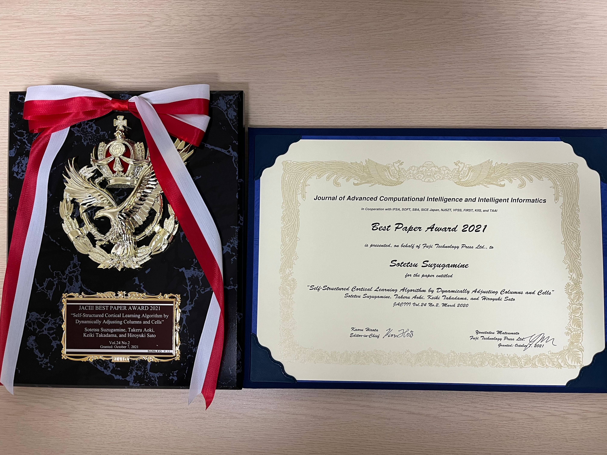

# About me

- Name
    - 鈴ヶ嶺 聡哲 / Sotetsu Suzugamine
- Blog
    - [suzuzusu日記](https://suzuzusu.hatenablog.com/)
- Github
    - [suzusuzu](https://github.com/suzusuzu)
- Twitter
    - [suzu_3_14159265](https://twitter.com/suzu_3_14159265)
- Kaggle
    - [suzu](https://www.kaggle.com/sotetsusuzugamine)
- Qiita
    - [suzu_](https://qiita.com/suzusuzu)
- LinkedIn
    - [Sotetsu Suzugamine](https://www.linkedin.com/in/sotetsu-suzugamine/)
- Award
    - [JACIII BEST PAPER AWARD 2021](https://www.fujipress.jp/award/jaciii-best-paper-and-young-researcher-awards-2021/)
        - 
    - [令和元年度目黒会賞](https://megurokai.jp/web_magazine/commendation200325/)
    - [SCIS&ISIS2018 Best Paper Award](https://www.uec.ac.jp/news/prize/2018/20181213_1496.html)
        - 
    - [平成29年度目黒会賞](https://megurokai.jp/web_magazine/commendation180326/)
- Presentation
    - [Azure Hybrid Cloud Day 2023](https://msevents.microsoft.com/event?id=57716160)
    - [CloudNative Days Tokyo 2022](https://event.cloudnativedays.jp/cndt2022)
        - [AWS Outpostsで始めるエッジコンピューティング](https://speakerdeck.com/suzusuzusuzu/cndt2022-aws-outpoststeshi-meruetusikonhiyuteinku)
    - [Open NetworkIng Conference Japan 2022](https://onic.jp/program-detail/#s_11)
        - [AWS/AzureのHybridCloud製品によるエッジコンピューティング](https://speakerdeck.com/suzusuzusuzu/azurenohybridcloudzhi-pin-niyoruetusikonhiyuteinku-onic2022)
    - [HCCJP(ハイブリッドクラウド研究会) 第31回勉強会](https://hybridcloud.connpass.com/event/242589/)
        - [【日本初導入】AWSをオンプレで使う！？「AWS Outpostsを用いたIoT/MLシステム」](https://speakerdeck.com/suzusuzusuzu/mlsisutemu)
    - [NVIDIA GTC CONFERENCE & TRAINING MARCH 21 - 24, 2022 KEYNOTE MARCH 22 アプリケーション開発者向けの大規模GPUプラットフォームのケーススタディ [S41188]](https://www.nvidia.com/ja-jp/gtc/session-catalog/?search.language=1594320459782002LzDW&tab.scheduledorondemand=1583520458947001NJiE#/session/1634898432884001Ixrc)
    - [NTT Tech Conference #5](https://ntt-developers.github.io/ntt-tech-conference/05/)
        - [macOS の仮想化技術について 〜 virtualization-rs Rust bindings for Virtualization.framework 〜](https://www.slideshare.net/td-nttcom/macos-virtualizationrs-rust-bindings-for-virtualizationframework)
    - [ついにGPU搭載! Azure Stack Hub with GPUの実力は?!](https://hybridcloud.connpass.com/event/204287/)
        - [【たぶん日本初導入！】Azure Stack Hub with GPUの性能と機能紹介](https://www.slideshare.net/td-nttcom/azure-stack-hub-with-gpu-244289645)
    - 映像情報メディア学会 2021年冬季大会 ［企画セッション4］MLOpsに基づくAI/ML実運用最前線
        - [クラウド上で実現するリアルタイムネットワークトラフィックのMLOps基盤](https://www.ite.or.jp/winter/2021/program/feature/#S4)
- Contest
    - [AWS GameDay Online APN Cup.vol1 3位](https://aws.amazon.com/jp/blogs/psa/aws-gameday-online-apn-cup-vol1-2020/)
- Hackathon
    - [第3回全脳アーキテクチャハッカソン 奨励賞、スポンサー賞(ふるや総合会計事務所賞)](https://wba-initiative.org/2755/)
    - ソニーハッカソン ～GO FOR IT～ 最優秀賞
    - GREE Camp優勝
- Online article
    - [1秒の遅延が損失に――クラウド中央処理の課題3つ　解決策は「エッジAI」　システム構築のポイントは？](https://www.itmedia.co.jp/news/articles/2301/10/news012.html)
    - [エッジコンピューティング最前線 “地産地消“で大きな価値を生むデータ NTT Comが開発した「エッジAI」の可能性](https://special.nikkeibp.co.jp/atclh/NXT/23/delltechnologies0113/)
    - [【連載】徹底研究! ハイブリッドクラウド [24] Azure Stack Hub with GPUに見るエッジコンピューティングの未来像](https://news.mynavi.jp/itsearch/article/cloud/5562)
    - [当時のx86は要件を満たしていなかった 要件・仕組みから見るmacOSの仮想化技術の変遷](https://logmi.jp/tech/articles/324461)
    - [macOS 11 Big Surで追加されたVM作成の高レベルAPI Virtualization.frameworkの性能はDockerとほぼ同じ](https://logmi.jp/tech/articles/324504)
- Online seminar
    - [ 1/24（火）開催オンラインセミナー「エッジAIに最適なハイブリッドでのコンテナ運用基盤とは？」](https://active.nikkeibp.co.jp/atcl/ev/seminar/22/12/05/00055/index.html)
- Corporate Blog
    - [AWS Outposts サーバーを徹底解説](https://engineers.ntt.com/entry/2023/03/24/095642)
    - [Local cluster for EKS on AWS Outpostsについて紹介](https://engineers.ntt.com/entry/2022/11/08/080222)
    - [コンピュータビジョン分野のトップカンファレンスであるECCV2022からワークショップの模様を紹介（前編）](https://engineers.ntt.com/entry/2022/12/09/145410)
    - [コンピュータビジョン分野のトップカンファレンスであるECCV2022の論文紹介（後編）](https://engineers.ntt.com/entry/2023/02/28/091914)
    - [AWS Outpostsで実現するオンプレデータレイク](https://engineers.ntt.com/entry/2022/08/09/082249)
    - [コンピュータビジョン分野における世界最高峰の国際会議CVPR2022からワークショップの模様を紹介（前編）](https://engineers.ntt.com/entry/2022/07/28/090254)
    - [コンピュータビジョン分野における世界最高峰の国際会議CVPR2022の論文紹介（後編）](https://engineers.ntt.com/entry/2022/08/01/090230)
    - [【日本初導入】 AWS Outposts ラックを徹底解説 第1回 〜導入・利用方法の概要〜](https://engineers.ntt.com/entry/2022/03/15/102459)
    - [【日本初導入】AWS Outposts ラックを徹底解説 第3回 〜TerraformによるPrivate EKS構築〜](https://engineers.ntt.com/entry/2022/03/17/094254)
    - [Rustで実装するmalloc](https://engineers.ntt.com/entry/2021/12/21/125459)
    - [コンピュータビジョン分野における世界最高峰の国際会議ICCV21の論文&コード紹介（前編）](https://engineers.ntt.com/entry/2021/11/08/150149)
    - [コンピュータビジョン分野における世界最高峰の国際会議ICCV21の論文&コード紹介（後編）](https://engineers.ntt.com/entry/2021/11/12/100757)
    - [MIRU2021参加レポート](https://engineers.ntt.com/entry/2021/08/06/145238)
